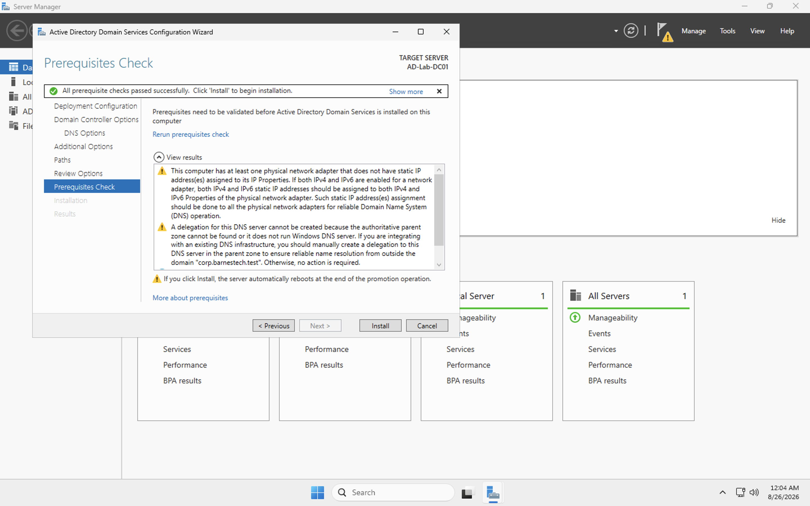
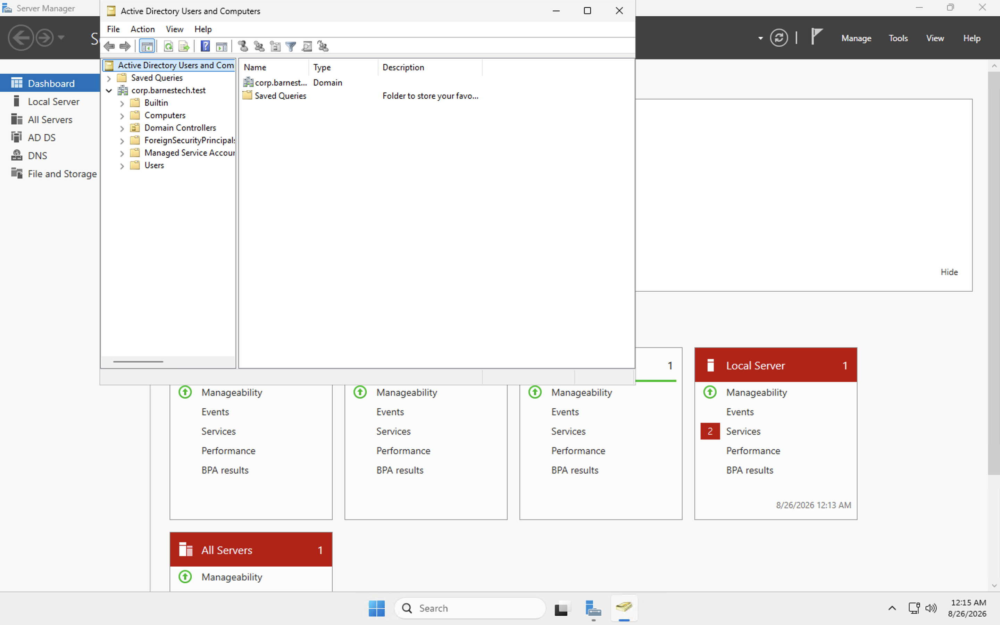
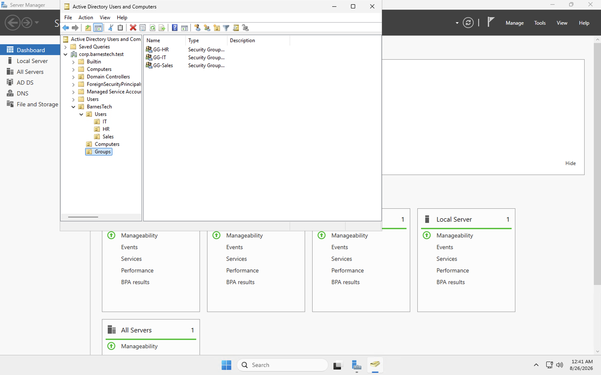
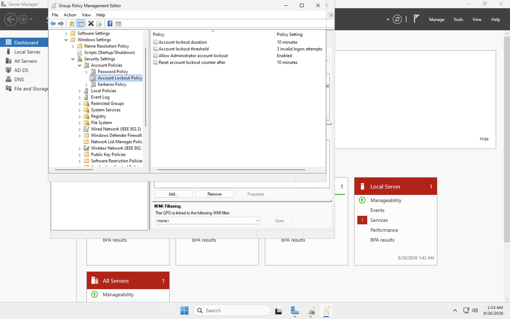
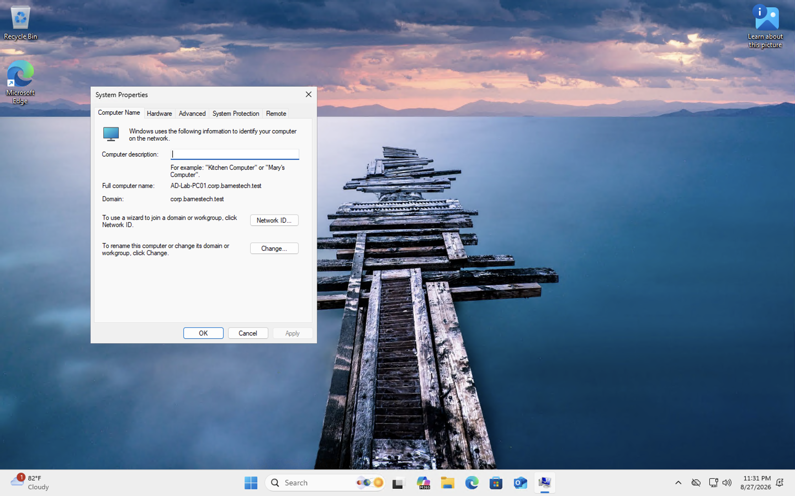
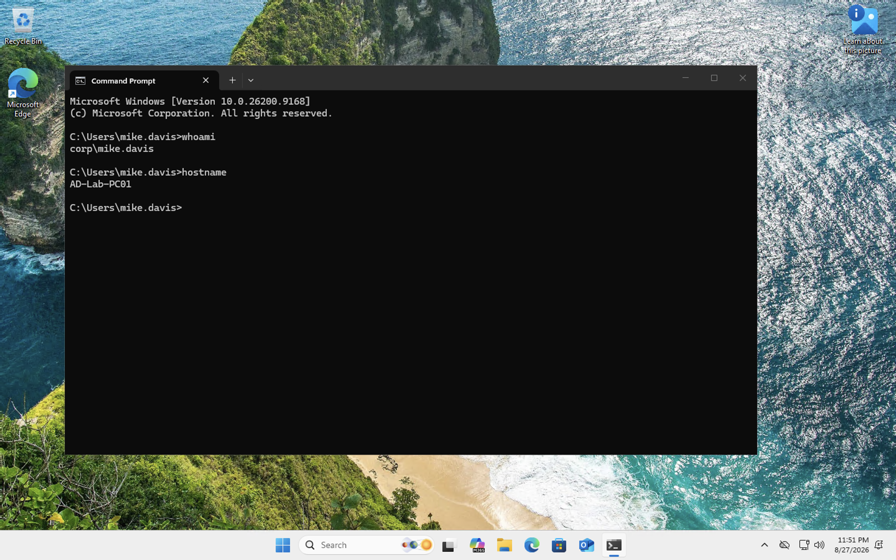

# Active Directory Lab in Azure

I built this lab to get hands-on experience with Active Directory and some of the tasks I would expect to see in an entry-level IT/help desk role.

The environment is hosted in Microsoft Azure and currently has a Windows Server 2025 domain controller and a Windows 11 workstation.

## Environment

- Domain: `corp.barnestech.test`
- Domain Controller: `AD-Lab-DC01`
- Windows 11 Client: `AD-Lab-PC01`
- Windows Server 2025
- Windows 11 Pro
- Active Directory Domain Services
- DNS
- Group Policy
- Azure Virtual Machines

## Active Directory Setup

I installed Active Directory Domain Services on `AD-Lab-DC01` and promoted the server to a domain controller for a new forest.

After the server restarted, I verified that the new domain was working through Active Directory Users and Computers.

## Users, OUs, and Groups

I created a basic company structure under a `BarnesTech` OU with separate areas for users, computers, and groups.

I also created IT, HR, and Sales departments and made security groups for each department.

Some of the user administration tasks I practiced were:

- Creating users
- Resetting passwords
- Unlocking accounts
- Enabling and disabling accounts
- Adding users to security groups
- Moving users between departments

## Account Lockout Policy

I used Group Policy to create an account lockout policy for the lab. I set the threshold to three failed login attempts so I could intentionally lock out a test account and practice unlocking it.

## Windows 11 Client

I created a second Azure VM running Windows 11 Pro and placed it on the same virtual network as the domain controller.

I configured the client to use the domain controller for DNS and joined it to `corp.barnestech.test`.

I then logged into the workstation using the domain account `CORP\mike.davis`.

## What I've Practiced So Far

- Active Directory user and group management
- Password resets and account unlocks
- Organizational Units
- Group Policy
- DNS for Active Directory
- Joining a Windows workstation to a domain
- Domain user authentication
- Azure networking
- RDP

## Next Steps

I'm continuing to expand the lab with more Group Policy, permissions, shared folders, and help desk troubleshooting scenarios.
